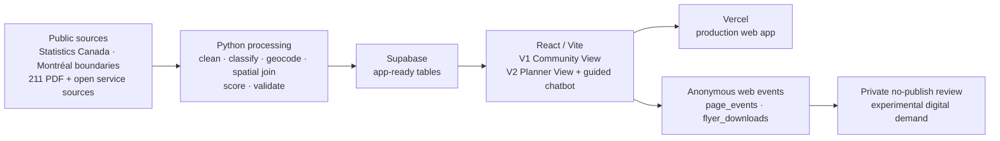

# Community Needs Radar

[](https://comm-need-radar.vercel.app)

Community Needs Radar is a decision-support web application for finding
community services and comparing structural vulnerability with service access
across 12 Greater Montréal review areas. It is a proof of concept: useful for
exploration and testing, but not a case-management system, eligibility checker,
or complete inventory of community need.

## What the tool does

| Product surface | User | What it supports |
| --- | --- | --- |
| **V1 Community View** | Frontline staff, volunteers, and residents | Search and filter services, view them on a map, and download a printable referral flyer. |
| **V2 Planner View** | Community organizations, funders, and planners | Compare Census-based vulnerability, service accessibility, gap scores, rankings, and area details. |
| **Planner guided chatbot** | Planner View users | Choose a supported planning question and receive a deterministic answer from the same Supabase tables used by the Planner dashboard. |

Try the deployed application at
[comm-need-radar.vercel.app](https://comm-need-radar.vercel.app).

## Run it locally

Requirements: Git, Node.js 22+, and npm.

```bash
git clone https://github.com/frondyff/comm_need_radar.git
cd comm_need_radar/frontend
npm ci
npm run dev
```

Open `http://localhost:5173`.

The app runs with an explicitly labelled demonstration fallback when Supabase
is not configured. To use the project data, copy `frontend/.env.example` to
`frontend/.env` and set:

```text
VITE_SUPABASE_URL=https://your-project.supabase.co
VITE_SUPABASE_PUBLISHABLE_KEY=your-public-browser-key
```

Never put a Supabase secret or service-role key in a `VITE_` variable. Browser
variables are bundled into public JavaScript.

## How it works



The production interface reads application-ready rows rather than calculating
scores in the browser:

1. Python scripts transform public Census, boundary, transit, and service
   sources into reproducible tables.
2. Structural vulnerability is the equal-weight average of five normalized
   Census dimensions: income, age, language, recent immigration, and housing.
3. Accessibility combines straight-line distance to services and the number of
   services within 2.5 km.
4. `gap_score = vulnerability_score × (100 - accessibility_score) / 100`.
5. Supabase serves the area, score, accessibility, and service tables to the
   React application; Vercel hosts the frontend and server routes.
6. Anonymous V1 interactions can be written to `page_events` and
   `flyer_downloads`. These are digital-demand signals only and do **not**
   change the production gap score.

## Data truth and scope

| Layer | Current basis | Production use |
| --- | --- | --- |
| Structural vulnerability | Statistics Canada 2021 Census indicators | Used in `area_profile` and `gap_score` |
| Area boundaries | Ville de Montréal open boundary data, including the documented A001/A002 partition | Used by the Planner map and spatial processing |
| Service directory | `services_master`, 3,664 deduplicated rows assembled from the public 211 Greater Montréal PDF and other public/open sources | Used by V1, Planner maps, and Planner chatbot service lookup |
| Accessibility | Current service-centre layer, 2.5 km straight-line threshold, and service counts | Used in production `gap_score` |
| Web behavior | Anonymous version-2 events in `page_events` and `flyer_downloads`, privacy-gated at `k >= 5` | Experimental digital-demand candidate; not published into `gap_score` |
| Demonstration inputs | Synthetic area/service fallbacks and committed synthetic visitor-tag examples | Development and explanation only; labelled and excluded from production scoring |

The public 211 directory is a source for service discovery, not evidence of
resident need. Website behavior shows interaction with this particular tool,
not population-level demand, partner encounters, or 211 call volume.

## Important assumptions and limitations

- The analysis covers 12 review areas and is not a complete Greater Montréal
  regional model.
- Census values describe structural conditions at an area level; they do not
  describe or predict an individual resident.
- Accessibility is an initial proximity-and-count proxy. It does not yet model
  transit time, mobility barriers, operating hours, capacity, eligibility,
  waitlists, service quality, or language availability.
- Service listings can become stale and should be confirmed with the provider
  before referral.
- The Planner guided chatbot only answers predefined, data-grounded questions.
  It does not provide professional advice or determine eligibility.
- Analytics are anonymous and insert-only from the browser. No client name,
  contact information, free-text case note, or precise home location should be
  collected.
- Experimental observed-demand scoring remains structural-only until all
  coverage and privacy gates pass and the team records a separate approval to
  publish it.

## Repository map

```text
frontend/                 React/Vite product and Vercel server routes
scripts/                  Data preparation, scoring, validation, and chatbot tools
src/comm_need_radar/      Reusable Python geospatial and scoring modules
supabase/                 Database migrations and SQL contract tests
data/raw/                 Versioned public/sample inputs
data/processed/           Reproducible app-ready outputs
tests/                    Python unit and contract tests
docs/                     Canonical product guides, reference docs, and archive
.github/workflows/        CI, production grill, release, and dry-run automation
```

The React/Vite application is the only supported application UI and the only
documented local and production entrypoint.

## Validate a change

Run the core repository checks:

```bash
python3 -m unittest discover -s tests
python3 scripts/validate_spatial_joins.py
python3 scripts/validate_scoring_bias.py

cd frontend
npm ci
npm run typecheck:api
npm run test:unit
npm run validate:boundaries
npm run validate:dashboard-adapter
npm run validate:chatbot
npm run build
```

Production browser, accessibility, security, performance, load, promotion, and
rollback checks are documented in
[`docs/reference/operations/production-testing.md`](docs/reference/operations/production-testing.md).

## Read next

- [V1 Community View](docs/v1-frontline.md)
- [V2 Planner View and scoring](docs/v2-planner.md)
- [Planner guided chatbot](docs/chatbot.md)
- [Data inventory](docs/reference/data/DATA_INVENTORY.md)
- [Interfaces and table contracts](docs/reference/data/interfaces.md)
- [Scoring and metrics guide](docs/reference/scoring/scoring-metrics-guide.md)
- [Supabase operations](docs/reference/operations/supabase-operations.md)
- [Submission checklist](docs/reference/submission/submission-checklist.md)
- [Historical planning archive](docs/archive/index.md)

## Collaboration and release model

- `dev` is the integration branch and the source of the current Vercel
  production release workflow.
- `main` is the stable submission branch.
- Each change should have a linked GitHub issue and a focused pull request.
- Data-contract changes must update the interface documentation and tests.
- Do not commit secrets, private datasets, personally identifiable information,
  or generated secure exports.

The repository is licensed and governed by the terms recorded in its GitHub
project settings; no separate software license has been declared in this proof
of concept.
