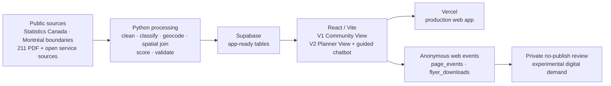

# Community Needs Radar

[](https://comm-need-radar.vercel.app)

Community Needs Radar is a decision-support web application for finding
community services and comparing structural vulnerability with service access
across 12 Greater Montréal review areas. It is a proof of concept: useful for
exploration and testing, but not a case-management system, eligibility checker,
or complete inventory of community need.

## What the tool does

| Product surface | User | What it supports |
| --- | --- | --- |
| **V1 Community View** | Frontline staff, volunteers, and residents | Search and filter services, view them on a map, and download a printable referral flyer. |
| **V2 Planner View** | Community organizations, funders, and planners | Compare Census-based vulnerability, service accessibility, gap scores, rankings, and area details. |
| **Planner guided chatbot** | Planner View users | Choose a supported planning question and receive a deterministic answer from the same Supabase tables used by the Planner dashboard. |

Try the deployed application at
[comm-need-radar.vercel.app](https://comm-need-radar.vercel.app).

## Run it locally

Requirements: Git, Node.js 22+, and npm.

```bash
git clone https://github.com/frondyff/comm_need_radar.git
cd comm_need_radar/frontend
npm ci
npm run dev
```

Open `http://localhost:5173`.

The app runs with an explicitly labelled demonstration fallback when Supabase
is not configured. To use the project data, copy `frontend/.env.example` to
`frontend/.env` and set:

```text
VITE_SUPABASE_URL=https://your-project.supabase.co
VITE_SUPABASE_PUBLISHABLE_KEY=your-public-browser-key
```

Never put a Supabase secret or service-role key in a `VITE_` variable. Browser
variables are bundled into public JavaScript.

## How it works



The production interface reads application-ready rows rather than calculating
scores in the browser:

1. Python scripts transform public Census, boundary, transit, and service
   sources into reproducible tables.
2. Structural vulnerability is the equal-weight average of five normalized
   Census dimensions: income, age, language, recent immigration, and housing.
3. Accessibility combines straight-line distance to services and the number of
   services within 2.5 km.
4. `gap_score = vulnerability_score × (100 - accessibility_score) / 100`.
5. Supabase serves the area, score, accessibility, and service tables to the
   React application; Vercel hosts the frontend and server routes.
6. Anonymous V1 interactions can be written to `page_events` and
   `flyer_downloads`. These are digital-demand signals only and do **not**
   change the production gap score.

## Data sources

Every production record traces back to a named public source. The 211 directory
is licensed content used with attribution; the raw PDF and its extracts are kept
out of version control.

| Source | Provider | Terms | What it contributes | Loaded into |
| --- | --- | --- | --- | --- |
| Directory of Social and Community Resources | 211 Grand Montréal / Centraide | Licensed, attribution required, raw file not committed | Core service directory: names, phones, addresses, categories | `services_master` |
| 2021 Census Profile (tract level) | Statistics Canada | Open (StatCan licence) | Income, age, language, recent immigration, and housing indicators per census tract | `census_tract`, `area_profile` |
| Review-area and borough boundaries | Ville de Montréal open data | Open (CC BY 4.0) | Geometry for the 12 review areas, including the A001/A002 partition | area geography, spatial joins |
| Social-service points | OpenStreetMap (Overpass API) | Open (ODbL) | Additional open service locations to broaden coverage | `services_master` |
| Health and social facilities | MSSS (Quebec) | Open | Public health and social service centres, with food-bank fallbacks | `services_master` |
| Indigenous community resources | INDex (reseaumtlnetwork.com) | Public directory, attribution | Indigenous-serving organizations | `services_master` |
| Transit stops | STM GTFS feed | Open | Stop locations for the accessibility layer | `stm_stop` |
| Observed demand (visitor tags) | Synthetic, k-anonymized template | Development only, labelled | Illustrative frontline visit signals | `observed_need_index`, `observed_need_category_summary` |
| Anonymous web behavior | This application (V1 events) | Insert-only, privacy-gated at `k >= 5` | Experimental digital-demand candidate | `page_events`, `flyer_downloads` |

## Data pipeline

The pipeline is a set of small, reproducible Python scripts under `scripts/` and
`scripts/data_pipeline/`. Each stage writes a versioned CSV in `data/processed/`,
so the whole build is inspectable and repeatable.

- **Acquisition.** `download_sources.py` fetches the large public inputs (Census
  profile, boundaries, GTFS). Service fetchers pull open directories:
  `fetch_osm_services.py` (OpenStreetMap), `fetch_community_services.py` (MSSS),
  and `fetch_indigenous_services.py` (INDex).
- **Extraction.** `extract_211_directory.py` parses the licensed 211 / Centraide
  PDF into structured rows. `build_census_ct_variables.py` extracts the census
  indicators, `build_geography.py` prepares boundary inputs, and
  `build_transit_stops.py` reads STM stops.
- **Geocoding.** `geocode_211_directory.py` resolves addresses to coordinates
  with the free OpenStreetMap Nominatim service; `geocode_211_retry.py` runs a
  recovery pass. Each row keeps a geocode precision flag (exact, approximate, or
  none), so map precision is never overstated. Organizations without a public
  address are kept in the directory without a map pin.
- **Classification.** Two grounded, no-LLM classifiers run on the service text:
  `service_taxonomy.py` assigns a `primary_category` (Shelter, Food, Medical,
  Legal, Translation, and further community categories) by keyword matching, and
  `classify_service_audience.py` tags who each service serves for the app's
  filters (`serves_indigenous`, `serves_immigrant`, `gender_focus`, and
  `age_groups`).
- **Deduplication and merge.** `build_services_master.py` merges the 211
  directory with the open-data sources into one canonical table,
  `services_master` (3,664 deduplicated organizations). It removes duplicates,
  drops non-service noise, keeps every organization named, records each row's
  source, and assigns each mappable organization to one of the 12 review areas.
- **Vulnerability and spatial joins.** `aggregate_ct_to_areas.py` rolls the
  census indicators up to the 12 areas; `map_centers_to_areas.py` and
  `validate_spatial_joins.py` assign and check organization-to-area membership,
  producing `area_profile`.
- **Observed demand.** `generate_synthetic_visitor_tags.py` and
  `build_observed_need_index.py` produce the labelled `observed_need_index` and
  `observed_need_category_summary`, used for the chatbot's demand answers and
  kept out of the production gap score.
- **Assemble and load.** `build_database.py` loads every processed table into a
  single local SQLite database, then `load_to_cloud.py` atomically refreshes
  Supabase: the committed migrations own the schema, keys, indexes, and
  row-level security, while the loader only truncates and reloads row data and
  verifies row counts in one transaction.

## Database and schema

The SQL migrations in `supabase/migrations/` are the single source of truth for
schema, keys, indexes, views, grants, and row-level security. The Python loader
never alters schema; it only loads rows.

| Table | Contents |
| --- | --- |
| `services_master` | The 3,664 deduplicated organizations, with category, audience tags, coordinates, geocode precision, area, and source |
| `area_profile` | Per-area population, Census indicators, and structural vulnerability score and rank |
| `gap_score` | Per-area vulnerability, accessibility, gap score, rank, and priority flag |
| `accessibility` | Per-area, per-category service access (nearest distance, count within threshold, score) |
| `observed_need_index` | Per-area observed-demand aggregate and top needs, source-labelled |
| `observed_need_category_summary` | Observed demand by need category and area, source-labelled |
| `census_tract`, `ct_centroid` | Underlying census-tract inputs and centroids |
| `stm_stop` | STM transit stops for the accessibility layer |
| `page_events`, `flyer_downloads` | Anonymous, insert-only V1 web-behavior events |

The public browser key can only read the application tables (through `app_read_*`
policies) and can only insert anonymous analytics events. It cannot write to any
content table.

For the full per-table, per-column reference, including data types, real-versus-
synthetic labelling, and per-source provenance, see the
[data dictionary](docs/reference/data/data-dictionary.md).

## The Planner guided chatbot

The chatbot answers planning questions using only the project's own data. It is
grounded, deterministic, and free to run.

- No language model and no API key. It is a guided decision tree: the user
  navigates menus and every leaf runs one parameterized Supabase query.
- Every answer displays the source table it came from, so results are traceable
  and never invented. It declines cleanly when data is not collected, and on
  exit it shows a summary of the session and a short closing message.
- It appears only in the V2 Planner View, not in V1 Community View.

There are two parallel implementations with the same behavior: a terminal
version in Python (`scripts/chatbot.py`, `scripts/chatbot_menu.py`,
`scripts/chatbot_queries.py`) and the web widget
(`frontend/src/chatbot/ChatbotWidget.jsx` for menus and session history,
`frontend/src/chatbot/groundedChatbot.js` for the browser-side queries).

Supported question types:

- **Find services** by category, area, and audience (Indigenous, immigrant,
  women, youth, seniors). Age filters exclude the "serves all ages" default so a
  group filter returns organizations that actually focus on that group.
- **Service demand** for a category: the recorded demand in a chosen area, or
  the areas with the highest demand.
- **About an area**: an overview (vulnerability and gap), demographics, or total
  observed demand for any of the 12 areas.
- **City-wide rankings**: most vulnerable areas, largest service gap, most
  immigrants, or income pressure.

Demand answers are labelled by their basis (synthetic visitor tags or anonymous
web behavior), so they are never presented as verified population demand.

For the full safety boundary, language behavior, per-menu source mapping, and
validation steps, see the [Planner guided chatbot reference](docs/chatbot.md).

## Data truth and scope

| Layer | Current basis | Production use |
| --- | --- | --- |
| Structural vulnerability | Statistics Canada 2021 Census indicators | Used in `area_profile` and `gap_score` |
| Area boundaries | Ville de Montréal open boundary data, including the documented A001/A002 partition | Used by the Planner map and spatial processing |
| Service directory | `services_master`, 3,664 deduplicated rows assembled from the public 211 Greater Montréal PDF and other public/open sources | Used by V1, Planner maps, and Planner chatbot service lookup |
| Accessibility | Current service-centre layer, 2.5 km straight-line threshold, and service counts | Used in production `gap_score` |
| Web behavior | Anonymous version-2 events in `page_events` and `flyer_downloads`, privacy-gated at `k >= 5` | Experimental digital-demand candidate; not published into `gap_score` |
| Demonstration inputs | Synthetic area/service fallbacks and committed synthetic visitor-tag examples | Development and explanation only; labelled and excluded from production scoring |

The public 211 directory is a source for service discovery, not evidence of
resident need. Website behavior shows interaction with this particular tool,
not population-level demand, partner encounters, or 211 call volume.

## Important assumptions and limitations

- The analysis covers 12 review areas and is not a complete Greater Montréal
  regional model.
- Census values describe structural conditions at an area level; they do not
  describe or predict an individual resident.
- Accessibility is an initial proximity-and-count proxy. It does not yet model
  transit time, mobility barriers, operating hours, capacity, eligibility,
  waitlists, service quality, or language availability.
- Service listings can become stale and should be confirmed with the provider
  before referral.
- The Planner guided chatbot only answers predefined, data-grounded questions.
  It does not provide professional advice or determine eligibility.
- Analytics are anonymous and insert-only from the browser. No client name,
  contact information, free-text case note, or precise home location should be
  collected.
- Experimental observed-demand scoring remains structural-only until all
  coverage and privacy gates pass and the team records a separate approval to
  publish it.

## Repository map

```text
frontend/                 React/Vite product and Vercel server routes
scripts/                  Data preparation, scoring, validation, and chatbot tools
src/comm_need_radar/      Reusable Python geospatial and scoring modules
supabase/                 Database migrations and SQL contract tests
data/raw/                 Versioned public/sample inputs
data/processed/           Reproducible app-ready outputs
tests/                    Python unit and contract tests
docs/                     Canonical product guides, reference docs, and archive
.github/workflows/        CI, production grill, release, and dry-run automation
```

The React/Vite application is the only supported application UI and the only
documented local and production entrypoint.

## Validate a change

Run the core repository checks:

```bash
python3 -m unittest discover -s tests
python3 scripts/validate_spatial_joins.py
python3 scripts/validate_scoring_bias.py

cd frontend
npm ci
npm run typecheck:api
npm run test:unit
npm run validate:boundaries
npm run validate:dashboard-adapter
npm run validate:chatbot
npm run build
```

Production browser, accessibility, security, performance, load, promotion, and
rollback checks are documented in
[`docs/reference/operations/production-testing.md`](docs/reference/operations/production-testing.md).

## Read next

- [V1 Community View](docs/v1-frontline.md)
- [V2 Planner View and scoring](docs/v2-planner.md)
- [Planner guided chatbot](docs/chatbot.md)
- [Data inventory](docs/reference/data/DATA_INVENTORY.md)
- [Interfaces and table contracts](docs/reference/data/interfaces.md)
- [Scoring and metrics guide](docs/reference/scoring/scoring-metrics-guide.md)
- [Supabase operations](docs/reference/operations/supabase-operations.md)
- [Submission checklist](docs/reference/submission/submission-checklist.md)
- [Historical planning archive](docs/archive/index.md)

## Collaboration and release model

- `dev` is the integration branch and the source of the current Vercel
  production release workflow.
- `main` is the stable submission branch.
- Each change should have a linked GitHub issue and a focused pull request.
- Data-contract changes must update the interface documentation and tests.
- Do not commit secrets, private datasets, personally identifiable information,
  or generated secure exports.

The repository is licensed and governed by the terms recorded in its GitHub
project settings; no separate software license has been declared in this proof
of concept.
