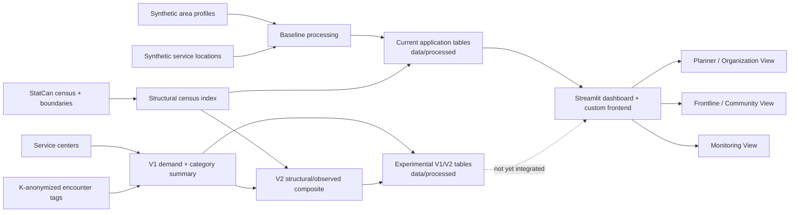

# Architecture

## Core Flow

## Data Layer

- `data/raw/`: synthetic, demonstration, and current StatCan/boundary inputs.
- `data/processed/`: cleaned, scored, dashboard-ready, and experimental V1/V2
  CSV files.

No bronze, silver, or gold layers are used.

See `docs/mvp-system-erd.md` for the application-facing and scoring-pipeline data
models.

See `docs/production-web-architecture.md` for the canonical React, Supabase,
Vercel, and server-side chatbot deployment boundary.

## Processing Layer

Baseline processing is handled by `scripts/build_processed_data.py`, which calls
package logic under `src/comm_need_radar/`.

The pipeline:

1. Loads raw synthetic area and service records.
2. Validates required columns and coordinates.
3. Normalizes vulnerability indicators.
4. Calculates nearest-service distance and service counts by category.
5. Creates accessibility scores.
6. Combines vulnerability and access into a gap score.
7. Writes processed outputs, monitoring summaries, and the documented role
   activity artifact.

The implemented scoring extension runs as explicit follow-on scripts:

1. `map_centers_to_areas.py` maps service centers to MVP areas.
2. `build_observed_need_index.py` creates the V1 frontline demand score, the
   category breakdown, and the fixed-component V2 observed score.
3. `build_vulnerability_index_v2.py` combines 60% structural census concern with
   40% observed evidence for an experimental planning score.

These outputs are stored in `data/processed/`, but V2 is not yet used as the
dashboard gap-score input.

## Application Layer

The Streamlit app reads only `data/processed/` files. The Cloud-ready
entrypoint is `streamlit_app.py`, which loads the dashboard package from
`src/comm_need_radar/dashboard/app.py`.

Views:

- Planner / Organization View.
- Frontline / Community View.
- Monitoring View.

The Planner and Frontline views use clickable Plotly maps. Planner users can
select a priority area from the map and inspect service-access gaps by category.
Frontline users can select service points from the map and produce a filtered
flyer from nearby services.

## Deployment Position

Local execution is the default and required fallback. Streamlit Community Cloud
can deploy the repository from `main` with `streamlit_app.py` as the main file.
The root `requirements.txt` supplies Python dependencies and
`.streamlit/config.toml` supplies app configuration.
