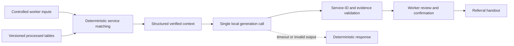

# AI Impact Roadmap

Date: 2026-07-02

Status: proposed next-stage roadmap

## Executive Recommendation

Prioritize a frontline referral copilot that reduces the time required to find,
compare, and explain suitable services. Keep matching, scoring, filtering, and
source validation deterministic. Use a small local language model only to turn
verified results into clear English or French explanations and draft handouts.

Do not train predictive machine-learning models from the current demonstration
data. The current 12 areas and 29 aggregate encounter groups are sufficient for
workflow validation, not reliable prediction. Collect operational evidence
first, then introduce forecasting after enough production history exists.

This roadmap extends the current [project definition](project-definition.md),
[V1/V2 design](../reference/scoring/vulnerability-index-v2-plan.md), and
[data contracts](../reference/data/interfaces.md). V1 and V2 calculations remain deterministic
and auditable.

## Intended Impact

Primary audience: frontline workers helping people locate appropriate services.

Primary outcome:

> Reduce the staff time needed to prepare a useful referral without reducing
> factual accuracy, privacy, or worker control.

The first release will measure operational impact only. It will not claim that
the copilot improves client outcomes because referral completion, service
contact, and service receipt are not being collected.

## Design Principles

1. Deterministic code remains the source of truth for scores and service facts.
2. The language model explains verified results; it does not invent, calculate,
   or independently approve anything.
3. A frontline worker confirms every generated handout before use.
4. No person-level identifiers, case notes, or free-text client circumstances
   are stored or sent to the model.
5. The deterministic assistant remains available whenever local inference fails.
6. Model, prompt, data snapshot, and scoring versions are recorded for audit.
7. Start with one bounded generation step, not an autonomous or multi-agent loop.

## Phase 1: Measurement Foundation

### Operational Event Store

Store anonymous workflow events in a local SQLite database with a CSV export for
analysis. Generate a random session identifier for each workflow and do not
store client identifiers.

Minimum event fields:

| Field | Purpose |
|---|---|
| `event_id` | Unique event identifier |
| `session_id` | Anonymous workflow identifier |
| `staff_id_hash` | Optional pseudonymous worker identifier for repeated-measures analysis |
| `event_timestamp` | Event time in UTC |
| `assistant_mode` | `deterministic`, `local_llm`, or `fallback` |
| `workflow_version` | Application workflow version |
| `area_id` | Selected service area |
| `need_category` | Controlled need category, not free text |
| `language` | Requested output language |
| `radius_km` | Search radius |
| `result_count` | Number of deterministic service matches |
| `event_name` | Start, results shown, suggestion accepted, overridden, handout generated, or completed |
| `elapsed_ms` | Time since workflow start |
| `llm_latency_ms` | Generation latency when applicable |
| `fallback_used` | Whether deterministic fallback was required |
| `model_version` | Local model identifier and quantization |
| `prompt_version` | Prompt-template version |
| `source_snapshot_id` | Version of the processed service data |

Prohibited fields:

- names, phone numbers, email addresses, or client IDs
- case notes or free-text client histories
- exact birthdates, immigration status, or legal details
- unaggregated demographic or health information

### Baseline

Collect two weeks of measurements from the current deterministic workflow before
enabling local generation. At minimum, measure:

- median and P95 task-completion time
- result and zero-result rates
- handout-generation rate
- worker override rate
- number of searches and filter changes per completed task

## Phase 2: Grounded Frontline Copilot

### Architecture



### Deterministic Responsibilities

Code, not the model, must:

- filter by area, need category, language, radius, and available source fields
- calculate distance, accessibility, V1, V2, and gap metrics
- select and order candidate services
- attach source freshness and evidence
- reject unknown service IDs or unsupported fields
- produce the deterministic fallback response

### Language-Model Responsibilities

The local model may:

- explain why verified services match the selected criteria
- compare verified options in plain language
- produce English or French text
- draft questions that the worker should verify with a provider
- draft a referral handout from approved structured fields

The model must not:

- create a service, address, phone number, eligibility rule, or opening hour
- determine benefit or service eligibility
- alter V1, V2, accessibility, or gap scores
- infer individual vulnerability from area-level data
- send messages, book appointments, or finalize a handout without confirmation

### Response Contract

The generation layer returns structured JSON:

```json
{
  "answer": "Plain-language explanation",
  "service_ids": ["S001", "S004"],
  "evidence": [
    {"service_id": "S001", "fields_used": ["service_category", "distance_km", "language"]}
  ],
  "verification_questions": ["Confirm current intake availability."],
  "limitations": ["Opening hours are not available in the current source."],
  "language": "en"
}
```

Validation fails when JSON is malformed, a service ID is absent from the
deterministic candidate set, or the answer contains an unsupported structured
fact. Failure immediately returns the deterministic response.

### Local Runtime

Initial runtime:

- `llama.cpp` using its local OpenAI-compatible HTTP server
- Qwen2.5 1.5B Instruct GGUF, `Q5_K_M` quantization
- one concurrent generation request
- 4,096-token maximum context
- 300-token maximum response
- temperature `0.1`
- 20-second timeout
- no durable chat memory

The official Qwen model card reports French support and a Q5_K_M model file of
approximately 1.3 GB. The current development machine has 8 GB RAM, no NVIDIA
GPU, and no installed model runtime, so latency and memory must be benchmarked
before integration. See the official [Qwen model card](https://huggingface.co/Qwen/Qwen2.5-1.5B-Instruct-GGUF)
and [llama.cpp repository](https://github.com/ggml-org/llama.cpp).

Do not purchase hardware during the pilot. If P95 latency exceeds the acceptance
gate, retain deterministic generation while evaluating a dedicated local host
through a separately approved cost decision.

## Phase 3: Impact Evaluation

### Pilot Design

Use a crossover evaluation with at least eight frontline workers and 200 total
standardized referral tasks. Each worker completes comparable tasks with both
the deterministic baseline and local copilot. Randomize the order to reduce
learning effects.

The evaluation set must include:

- common English and French referral requests
- no-match and sparse-result cases
- missing language or service metadata
- stale-source warnings
- suppressed or insufficient observed data
- conflicting filters
- malformed model output
- model timeout and unavailable-runtime cases
- attempts to request personal or unsupported eligibility advice

### Success Gates

Primary gate:

- at least 20% reduction in median referral-preparation time

Reliability and safety gates:

- task-completion rate does not decline from baseline
- unsupported service facts remain below 1% of evaluated responses
- zero fabricated services or critical privacy incidents
- at least 70% of suggestions are accepted without major correction
- median worker usefulness rating is at least 4 out of 5
- P95 generation time is at most 20 seconds
- deterministic fallback succeeds for every simulated model failure

Do not expand beyond the pilot unless every safety gate passes.

## Phase 4: Machine Learning

### Demand Forecasting

Begin forecasting only after collecting at least 52 weekly periods of approved,
consistent aggregate encounter data.

For each area and need category:

1. Establish seasonal-naive and moving-average baselines.
2. Backtest with rolling time windows.
3. Evaluate count-aware methods such as Poisson or negative-binomial regression.
4. Evaluate a boosted-tree model only when the dataset is sufficiently dense.
5. Deploy only when weighted forecast error improves by at least 10% over the
   strongest simple baseline and error remains acceptable across areas.

Forecasts may support staffing, outreach, and inventory planning. They must not
be used for person-level risk prediction or automatic resource denial.

### Service Ranking

Do not train a ranking model until at least 1,000 worker acceptance/override
decisions have been collected across multiple workers and service categories.
Evaluate the model offline first against the deterministic ranking. Treat worker
selections as potentially biased operational labels, not ground truth about
client outcomes.

### Anomaly Detection

Start with interpretable rolling medians and control limits for sudden demand or
data-quality changes. Introduce a learned anomaly model only if the deterministic
method produces an unacceptable false-alert rate.

## Cost-Benefit Measurement

### Benefit Formula

```text
monthly_labor_benefit =
    monthly_assisted_searches
  * median_minutes_saved
  / 60
  * loaded_frontline_hourly_cost
```

Because only operational metrics are collected, do not assign monetary value to
client outcomes, avoided crises, or successful referrals.

### Cost Formula

```text
monthly_operating_cost =
    hardware_cost / amortization_months
  + electricity_cost
  + maintenance_hours * technical_hourly_cost

first_year_total_cost =
    implementation_labor
  + frontline_review_labor
  + training_labor
  + 12 * monthly_operating_cost
```

### Decision Metrics

```text
first_year_net_benefit =
    12 * monthly_labor_benefit - first_year_total_cost

first_year_roi =
    first_year_net_benefit / first_year_total_cost

payback_months =
    implementation_and_training_cost
  / (monthly_labor_benefit - monthly_operating_cost)
```

Record actual labor rates, search volume, measured time savings, invoices, and
maintenance effort. Do not present software as cost-free merely because there
are no hosted token charges.

Scale beyond the pilot only when:

- projected first-year ROI exceeds 25%
- projected payback is below 12 months
- median task time improves by at least 20%
- all reliability and privacy gates pass

## Delivery Order

| Stage | Deliverable | Exit condition |
|---|---|---|
| 1 | Anonymous event instrumentation and baseline dashboard | Two baseline weeks collected |
| 2 | Deterministic context builder and response validator | Contract and failure tests pass |
| 3 | Local runtime integration with deterministic fallback | Latency, memory, and fallback gates pass |
| 4 | Worker pilot and cost-benefit report | Impact and safety gates evaluated |
| 5 | Production-data replacement and controlled rollout | Approved data, ownership, and support process exist |
| 6 | Forecasting experiment | At least 52 weekly periods and 10% backtest improvement |

## Required Tests And Evals

- deterministic service matching is unchanged by model availability
- every returned service ID belongs to the verified candidate set
- unsupported fields trigger fallback
- English and French responses retain the same verified facts
- prompts requesting personal data receive a refusal and safe workflow guidance
- no-match cases explain limitations without creating services
- timeouts and malformed JSON return deterministic results
- event logs contain no prohibited fields
- V1/V2 calculations remain identical with the copilot enabled or disabled
- cost-benefit calculations handle zero benefit and negative payback safely

## Known Limitations

- Operational metrics cannot establish whether clients ultimately receive help.
- Encounter counts may include repeat visits and reflect center coverage.
- A small CPU-hosted model may produce lower-quality language than a hosted
  model and may not support concurrent users.
- Current service records do not contain every eligibility, capacity, intake,
  or opening-hour fact that a worker may need.
- Forecasting value depends on consistent production data and stable category
  definitions.
