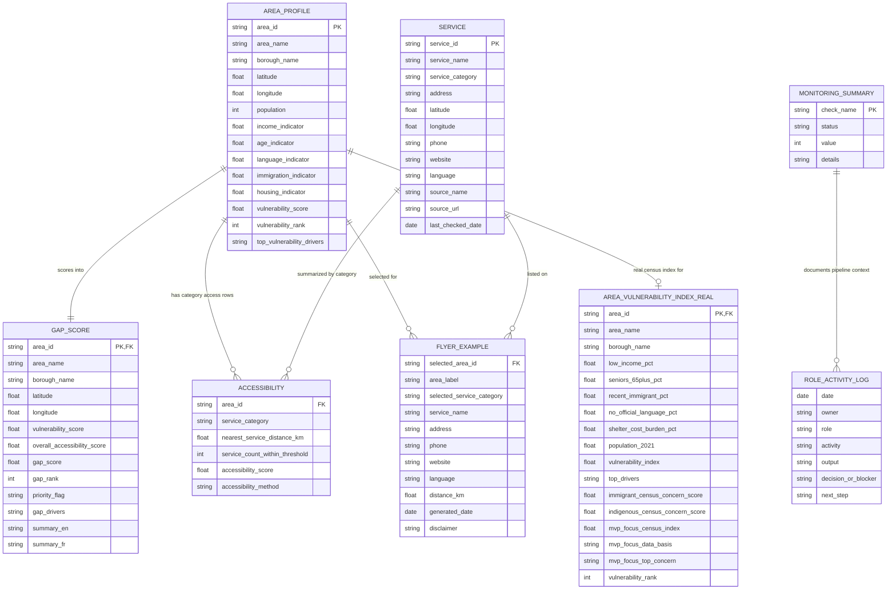
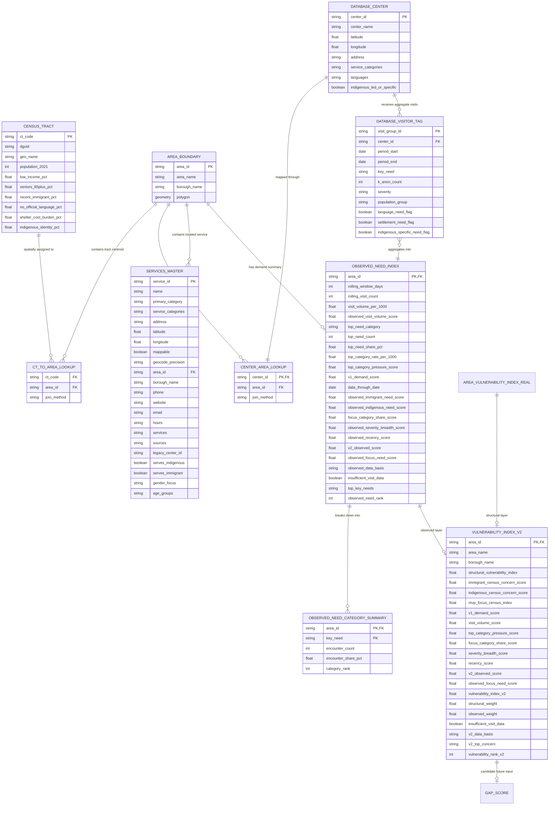

# MVP Data Models

Date updated: 2026-07-02

This document separates two related models:

1. The application-facing model contains the processed tables currently used by
   the dashboard and frontend.
2. The scoring pipeline model shows how census, geography, center, and
   k-anonymized encounter data produce V1 frontline demand and V2 planning
   scores.

## Application-Facing Data Model

## Scoring And Source Data Model

## Relationship Notes

- `AREA_PROFILE.area_id` is the main MVP area key.
- `GAP_SCORE.area_id`, `ACCESSIBILITY.area_id`, and
  `AREA_VULNERABILITY_INDEX_REAL.area_id` join back to `AREA_PROFILE.area_id`.
- `ACCESSIBILITY` is category-level, so its practical composite key is
  `area_id + service_category`.
- Current `FLYER_EXAMPLE` stores service details denormalized for printable
  output; it does not currently store `service_id`.
- Current service-to-accessibility linkage is by `service_category`, not direct
  service ID.
- The scoring pipeline uses explicit spatial lookup tables to assign census
  tracts and service centers to MVP areas.
- `DATABASE_VISITOR_TAG` must remain k-anonymized. Rows below `k=5` should be
  suppressed or rolled up before they reach the observed index.
- `OBSERVED_NEED_CATEGORY_SUMMARY` contains the full need-category distribution;
  `OBSERVED_NEED_INDEX` contains the area-level V1 and V2 observed summaries.
- `VULNERABILITY_INDEX_V2` is implemented as an experimental planning score but
  is not yet wired into `GAP_SCORE` or the application-facing views.
- `SERVICES_MASTER` is the canonical single services table: the 211 Grand
  Montréal directory merged with the open-data social/food/library service points,
  de-duplicated (3,664 actionable organizations; park amenities and name-only
  stubs excluded), classified, and area-assigned. `service_id` is the primary key;
  `area_id` is an enforced foreign key to `AREA_PROFILE` (0 orphans). Located rows
  carry `geocode_precision` = `exact` (real building, safe as a map pin) or
  `approximate` (street/postal-centroid, good for area assignment only); rows with
  no coordinate stay searchable by name/category. `legacy_center_id` is a soft
  reference (not a foreign key) back to `DATABASE_CENTER` — it is blank for 211-only
  orgs and can hold multiple `; `-joined ids for merged twins, so Frondy's scoring
  can reconcile against it while migrating. Until it migrates, `DATABASE_CENTER` /
  `CENTER_AREA_LOOKUP` and the scores are left intact and unchanged.
- `SERVICES_MASTER.serves_indigenous`, `serves_immigrant`, `gender_focus`, and
  `age_groups` power the app's who-is-served filters. They are keyword-derived
  from each org's services text + name (classify_service_audience.py), so treat
  them as best-effort hints: group and gender are reliable, age is looser.
