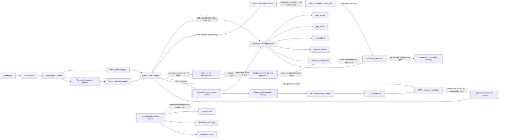

# Production Web Architecture

Status: planned target architecture for the React, Supabase, Vercel, and LLM
web deployment path.

This architecture keeps the React frontend lightweight, uses Supabase as the
real app-data source, deploys the web experience through Vercel, and places the
LLM chatbot behind a server-side API route so secrets and retrieval rules stay
out of browser code.

Implementation order and issue-by-issue acceptance steps are documented in
`docs/production-web-implementation-guide.md`.

## System Flow

## Deployment Responsibilities

- GitHub stores application code, docs, package manifests, and reviewed schema
  or migration notes.
- Vercel builds the `frontend/` React app and hosts preview and production web
  deployments.
- Supabase stores the app-ready tables consumed by the frontend and chatbot
  retrieval layer.
- The Vercel chatbot API route owns LLM calls, server-side data retrieval,
  response validation, and deterministic fallback behavior.

## Data And Secret Boundaries

- Browser code may use only `VITE_SUPABASE_URL` and
  `VITE_SUPABASE_PUBLISHABLE_KEY` (or the legacy anon key).
- The planner detail bars use the same-origin `/api/area-vulnerability`
  boundary. That route returns only aggregate 2021 Census fields from the
  private `area_vulnerability_index_real` table; its
  `SUPABASE_SECRET_KEY` remains server-side.
- Server-only variables such as LLM API keys, service-role keys, and database
  URLs must stay in Vercel environment variables and must not be committed.
- The first chatbot release should read app-ready tables only:
  `area_profile`, `gap_score`, `accessibility`, `services_master`,
  `observed_need_index`, and `vulnerability_index_v2`.
- Raw/source tables such as `census_tract`, `database_center`, and
  `database_visitor_tag` remain outside the browser-facing chatbot scope unless
  a separate privacy and RLS review approves them.
- The browser can insert versioned anonymous events into `page_events` and
  `flyer_downloads` but cannot read them. `database_visitor_tag` remains private
  even to anonymous/authenticated browser roles.
- Website behavior never updates `area_vulnerability_index_real` or
  `gap_score`. See `docs/web-observed-demand-scoring.md` for deduplication,
  exposure normalization, quality gates, and the owner decision boundary.

## Chatbot Service Boundary

The chatbot is an explanatory service, not a scoring or eligibility engine.
Deterministic code must select areas, filter service candidates, calculate
distances, and attach evidence before the LLM is called. The LLM may summarize
verified context, compare approved services, draft worker-facing explanations,
and produce English or French text.

Responses must be validated before returning to the UI. Invalid JSON, unknown
service IDs, unsupported facts, timeouts, or provider failures should return the
existing deterministic assistant response.
