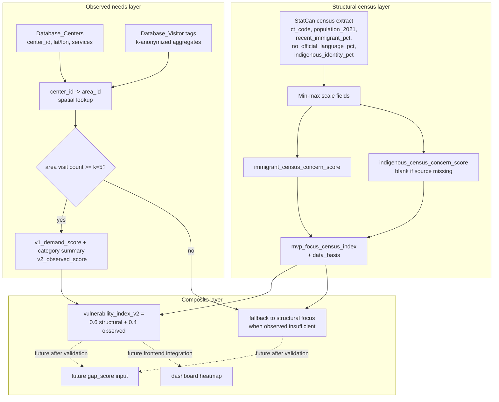

# Vulnerability Index V2 — Design And Implementation

Date updated: 2026-07-02

This document records the implemented V1/V2 scoring design following the
decision to focus on two groups:

- immigrants and newcomers
- Indigenous communities

It builds on the existing CISV-style census index in
[`census-variable-dictionary.md`](../data/census-variable-dictionary.md), the rebuilt
processed census outputs, and the real-data request in
[`laura-data-request-real-index.md`](../../archive/laura-data-request-real-index.md).

## Current Status

Implemented now:

- General structural census index:
  - `vulnerability_index`
  - `top_drivers`
  - `vulnerability_rank`
- Immigrant structural focus score:
  - `immigrant_census_concern_score`
- MVP focus structural score:
  - `mvp_focus_census_index`
  - `mvp_focus_data_basis`
  - `mvp_focus_top_concern`
- Rebuilt outputs:
  - `data/processed/census_vulnerability_index.csv`
  - `data/processed/statcan_census_vulnerability_index.csv`
  - `data/processed/area_vulnerability_index_real.csv`
- Frontline V1 demand and category summaries:
  - `v1_demand_score`
  - `top_need_category`, count, and share
  - `data/processed/observed_need_index.csv`
  - `data/processed/observed_need_category_summary.csv`
- Fixed-component V2 observed and composite scores:
  - `v2_observed_score`
  - `vulnerability_index_v2`
  - `data/processed/vulnerability_index_v2.csv`

Current data limitation:

```text
mvp_focus_data_basis = immigrant_census_only_indigenous_missing
```

The raw StatCan extract does not yet include `indigenous_identity_pct`, so
`indigenous_census_concern_score` is blank. The v2 design below treats that as a
known missing input, not as zero concern.

## Decision

Use a two-layer score per area:

```text
vulnerability_index_v2 = structural_weight * V_structural_focus
                       + observed_weight * v2_observed_score
```

Default weights:

```text
structural_weight = 0.6
observed_weight = 0.4
```

Rationale:

- Structural census data has complete geography coverage and is stable.
- Observed visitor/service data is more current but partial and noisier.
- The MVP still needs one priority score for heatmaps, gap scoring, and planner
  ranking.
- Raw observed key-needs should remain visible separately because they answer a
  different question: "what needs are showing up right now?"

Rejected alternatives:

- Replacing census data with observed data only. This would miss areas where
  people have not visited a center.
- Treating immigrant and Indigenous scores as person-level risk. The score is
  area/service-planning level only.
- Filling missing Indigenous census data with zero. Missing data must be flagged,
  not interpreted as low concern.

## Structural Layer

`V_structural_focus` is the census-based focus score.

### Immigrant Structural Concern

Already implemented from existing census columns:

```text
immigrant_census_concern_score =
    average(
        recent_immigrant_pct_scaled,
        no_official_language_pct_scaled
    )
```

Purpose:

- recent immigrant share captures settlement/newcomer support pressure.
- no official language share captures language-access barriers.

### Indigenous Structural Concern

Planned once Laura provides the missing census field:

```text
indigenous_census_concern_score = indigenous_identity_pct_scaled
```

Required raw field:

```text
indigenous_identity_pct
```

Optional QA fields:

```text
indigenous_identity_count
total_indigenous_identity_universe
```

Important interpretation rule:

- This is a service-planning geography indicator.
- It must not be used as person-level vulnerability scoring.
- Suppressed or missing values stay blank and trigger a data-basis flag.

### MVP Focus Census Index

When both focus scores exist:

```text
mvp_focus_census_index =
    average(
        immigrant_census_concern_score,
        indigenous_census_concern_score
    )
```

When Indigenous census data is missing:

```text
mvp_focus_census_index = immigrant_census_concern_score
mvp_focus_data_basis = immigrant_census_only_indigenous_missing
```

When both exist:

```text
mvp_focus_data_basis = immigrant_and_indigenous_census
```

## Observed Layer

`v2_observed_score` is derived from k-anonymized frontline/service data. It is
built from `Database_Visitor` joined to `Database_Centers`, then assigned to
areas through a center-to-area spatial lookup.

### Required Inputs

Center file:

```text
data/raw/database_centers.csv
```

Required fields:

```text
center_id
center_name
latitude
longitude
service_categories
languages
indigenous_led_or_specific
```

Observed visitor/service need file:

```text
data/raw/database_visitor_tags.csv
```

Required fields:

```text
visit_group_id
center_id
period_start
period_end
key_need
k_anon_count
severity
population_group
language_need_flag
settlement_need_flag
indigenous_specific_need_flag
```

For the web-observed production path, versioned `page_events` and
`flyer_downloads` are deduplicated and accumulated into the same
`database_visitor_tag` table with:

```text
source_type = web_behavior
area_id
k_anon_count                  # distinct anonymous sessions
weighted_demand_total         # accumulated event weights
service_impression_count      # exposure denominator
intent_rate_per_100_impressions
digital_demand_score          # coverage-gated 0–100 observed score
coverage_status
scoring_version
```

Raw session identifiers never enter `database_visitor_tag`. When web behavior
is published, `digital_demand_score` is the area `v2_observed_score`; synthetic
demonstration rows are not blended into that materialization.

### Privacy Floor

Observed records must be k-anonymized before processing:

```text
k_anon_count >= 5
```

Rules:

- Do not ingest person-level raw visitor records.
- Suppress or roll up any group below k=5.
- Do not report observed subgroup counts below k=5.
- Do not include names, phone numbers, exact birthdates, free-text case notes, or
  detailed immigration/legal status.

### Observed Sub-Scores

The implementation builds these per `area_id` over a trailing 90-day window:

```text
observed_visit_volume_score
observed_immigrant_need_score
observed_indigenous_need_score
observed_severity_breadth_score
observed_recency_score
```

Definitions:

- `observed_visit_volume_score`: k-anonymized encounter count normalized per 1,000
  residents.
- `observed_immigrant_need_score`: weighted count/share of language access,
  settlement navigation, newcomer support, and immigration legal needs.
- `observed_indigenous_need_score`: weighted count/share of Indigenous cultural
  support, Indigenous-led referral, and Indigenous-specific service needs.
- `observed_severity_breadth_score`: high-severity need share plus count of
  distinct need categories.
- `observed_recency_score`: exponential decay so recent needs have more weight.

Recommended high-severity tags:

```text
Housing & Shelter
Mental Health
Health & Wellness
Legal Aid
```

Recommended focus tags:

```text
Settlement Navigation
Language Access
Immigration Legal Need
Indigenous Cultural Support
Indigenous-Led Referral
Indigenous-Specific Service Need
```

### Frontline V1 Demand Score

V1 is an operational demand score for frontline workers. It combines encounter
volume with pressure from the most selected need category:

```text
visit_volume_score = min(100, encounters_per_1,000_population)
top_category_pressure_score = min(100, top_category_encounters_per_1,000_population)

v1_demand_score =
    0.70 * visit_volume_score
  + 0.30 * top_category_pressure_score
```

The top-category percentage is displayed for context but does not enter either
score. Counts are service encounters, not deduplicated people.

### V2 Observed Score

V2 consumes selected V1 components plus planning-specific observed factors:

```text
v2_observed_score =
    0.30 * visit_volume_score
  + 0.20 * top_category_pressure_score
  + 0.20 * focus_category_share_score
  + 0.20 * observed_severity_breadth_score
  + 0.10 * observed_recency_score
```

`focus_category_share_score` counts the union of immigrant/newcomer and
Indigenous-specific encounters, so an encounter matching multiple focus flags
is counted once. The fixed component set keeps scores comparable when an
Indigenous-specific subgroup is absent or suppressed.

If total area encounter volume is below k=5:

```text
insufficient_visit_data = true
v2_observed_score = blank
```

In that case, v2 falls back to structural only.

## Composite v2 Score

If observed data is sufficient:

```text
vulnerability_index_v2 =
    0.6 * mvp_focus_census_index
  + 0.4 * v2_observed_score
```

If observed data is insufficient:

```text
vulnerability_index_v2 = mvp_focus_census_index
v2_data_basis = structural_focus_only_observed_insufficient
```

If Indigenous census is missing but observed Indigenous need is sufficient:

```text
v2_data_basis = immigrant_census_plus_observed_focus
```

This lets the observed layer partially fill the Indigenous service-planning gap
without pretending the census structural input exists.

## Expected Output Tables

### `data/processed/observed_need_index.csv`

Grain: one row per `area_id`.

Required fields:

```text
area_id
rolling_window_days
rolling_visit_count
observed_visit_volume_score
top_need_category
top_need_count
top_need_share_pct
top_category_pressure_score
v1_demand_score
data_through_date
observed_immigrant_need_score
observed_indigenous_need_score
focus_category_share_score
observed_severity_breadth_score
observed_recency_score
v2_observed_score
observed_focus_need_score
observed_data_basis
insufficient_visit_data
top_key_needs
observed_need_rank
```

`observed_focus_need_score` is retained as a compatibility alias for
`v2_observed_score`.

### `data/processed/observed_need_category_summary.csv`

Grain: one row per `area_id` and `key_need`.

```text
area_id
key_need
encounter_count
encounter_share_pct
category_rank
```

### `data/processed/vulnerability_index_v2.csv`

Grain: one row per `area_id`.

Required fields:

```text
area_id
area_name
borough_name
structural_vulnerability_index
immigrant_census_concern_score
indigenous_census_concern_score
mvp_focus_census_index
observed_focus_need_score
v1_demand_score
visit_volume_score
top_category_pressure_score
focus_category_share_score
severity_breadth_score
recency_score
v2_observed_score
vulnerability_index_v2
structural_weight
observed_weight
insufficient_visit_data
v2_data_basis
v2_top_concern
vulnerability_rank_v2
```

## Implementation Tradeoffs

The implemented approach passes selected V1 indicators into V2 instead of the
complete V1 score.

| Approach | Pros | Cons |
|---|---|---|
| Selected V1 indicators (implemented) | Auditable contributions; limits recency inflation; keeps frontline and planning purposes distinct | More fields and weights; attendance still reflects center coverage and repeat visits |
| Whole V1 score | Simplest formula; V1 and V2 move together | Operational changes alter planning ranks; excludes focus, severity, and recency evidence |
| Separate V1 and V2 | Avoids attendance bias in vulnerability | V2 cannot respond to current frontline demand |

The implemented final-score contributions are 60% structural vulnerability,
12% V1 visit volume, 8% V1 top-category pressure, 8% focus-category share, 8%
severity/breadth, and 4% recency. These weights remain experimental until
validated with frontline and planning stakeholders.

## Grain Alignment

`Database_Centers` has lat/lon, not `area_id`. Add a one-time spatial join:

```text
center_id -> area_id
```

Implementation:

1. Load real area polygons.
2. Convert each center lat/lon to a point.
3. Run point-in-polygon.
4. Write `data/processed/center_area_lookup.csv`.
5. Join every visitor aggregate to `area_id` through `center_id`.

If real area polygons are not ready, use borough-level assignment as a temporary
fallback and clearly flag:

```text
join_method = borough_fallback
```

## Update Cadence

| Layer | Source | Refresh |
|---|---|---|
| `V_structural_focus` | StatCan census + area boundaries | Per census release or when Laura adds missing Indigenous field |
| V1 demand and `v2_observed_score` | `Database_Visitor` + `Database_Centers` | Rolling batch, initially nightly or demo refresh |
| `vulnerability_index_v2` | both layers | Recomputed whenever either layer refreshes |

## Implementation Steps

1. Update census input once Laura provides `indigenous_identity_pct`.
2. Rebuild:
   - `python3 scripts/build_statcan_vulnerability_index.py`
   - `.venv/bin/python scripts/aggregate_ct_to_areas.py`
3. Run `scripts/map_centers_to_areas.py`.
4. Maintain the `data/raw/database_centers.csv` contract.
5. Maintain the `data/raw/database_visitor_tags.csv` contract.
6. Run `scripts/build_observed_need_index.py`.
7. Use the scoring functions in `src/comm_need_radar/scoring/metrics.py`:
   - `v1_demand_score(...)`
   - `v2_observed_need_score(...)`
   - `composite_vulnerability_index(...)`
   - `has_sufficient_observed_data(...)`
8. Run `scripts/build_vulnerability_index_v2.py`.
9. Update dashboard/frontend heatmaps to allow toggles:
   - general structural vulnerability
   - immigrant census concern
   - Indigenous census concern, when available
   - V1 frontline demand
   - V2 observed need
   - vulnerability index v2
10. Add tests for:
    - k=5 suppression
    - missing Indigenous census fallback
    - observed insufficient-data fallback
    - V1 and V2 score bounds and fixed weights
    - category counts reconcile to total encounters

## Construction Diagram



## Production Data Still Needed From Laura

The pipeline currently runs with demonstration center and encounter inputs. The
minimum package for production replacement is:

1. `indigenous_identity_pct` added to
   `data/raw/statcan_2021_montreal_ct_variables.csv`.
2. Confirmed `ct_code` and `dguid` key format.
3. `data/raw/database_centers.csv`.
4. K-anonymized `data/raw/database_visitor_tags.csv`.
5. Source metadata and suppression notes.

See [`laura-data-request-real-index.md`](../../archive/laura-data-request-real-index.md) for
the detailed checklist.

## Out Of Scope

- Person-level vulnerability scoring.
- Unredacted visitor/case-management records.
- Reporting observed subgroup counts below k=5.
- Treating Indigenous identity itself as an individual risk label.
- Replacing the frontline flyer matching logic; the flyer can continue to use raw
  selected needs and nearby services.
