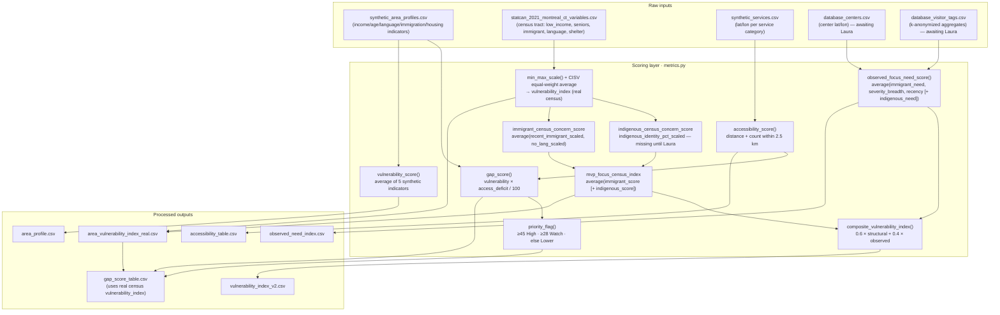
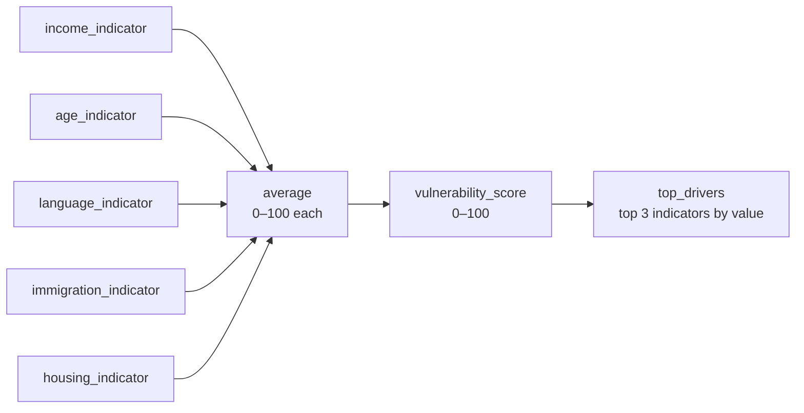
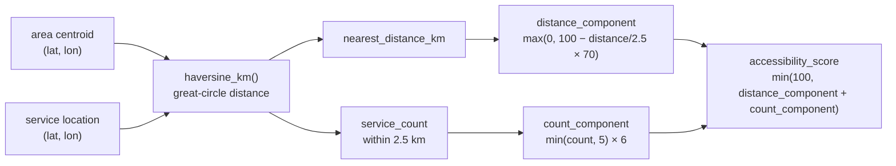
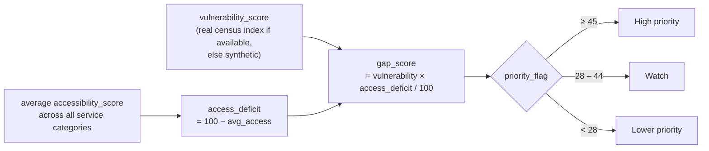
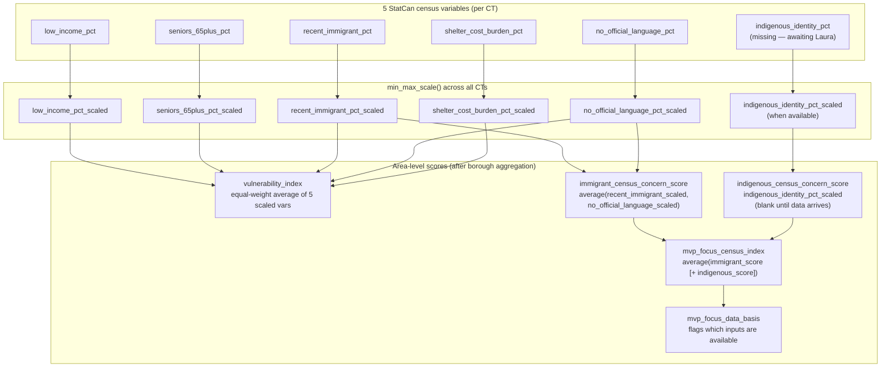
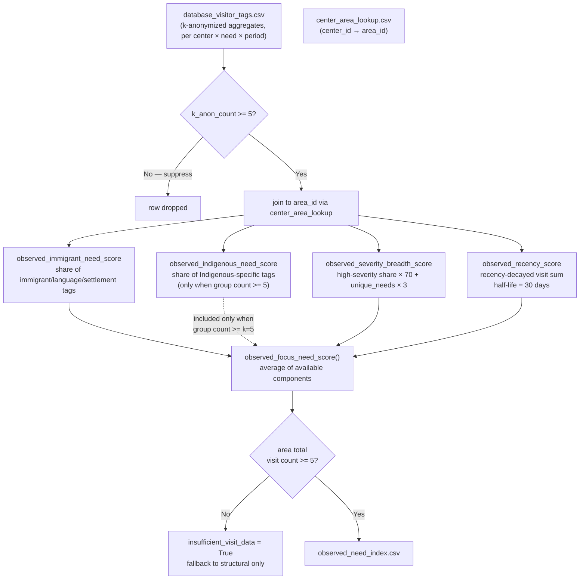
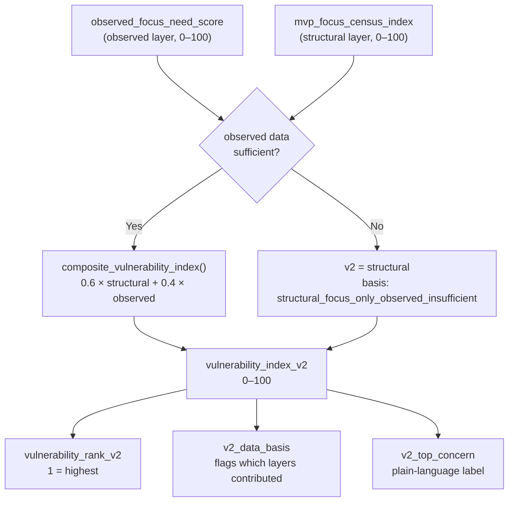

# Scoring And Metrics Guide

Owner: Frondy (geospatial / analytics lead)  
Last updated: 2026-06-26  
Source of truth: `src/comm_need_radar/scoring/metrics.py`

This document explains every scoring function used in the pipeline, the
formulas behind them, and how they connect into the final outputs. All scores
are in the range **0–100** unless noted.

---

## 1. Overall Pipeline



---

## 2. Synthetic Vulnerability Score

Used in `area_profile.csv`. Replaced by the real census index in
`gap_score_table.csv` when `area_vulnerability_index_real.csv` is present.



**Formula:**

```
vulnerability_score = average(income, age, language, immigration, housing)
top_drivers         = top 3 indicator labels sorted descending
```

---

## 3. Haversine Distance And Accessibility Score



**Formula:**

```
distance_component = max(0,  100 − (nearest_km / 2.5) × 70)
count_component    = min(service_count_within_2.5km, 5) × 6
accessibility_score = min(100, distance_component + count_component)
```

| Nearest service | Count within 2.5 km | Score |
|----------------:|--------------------:|------:|
| 0 km (at door)  | 5+                  | 100   |
| 1.25 km         | 3                   | 68    |
| 2.5 km          | 1                   | 36    |
| 5 km            | 0                   | 0     |

**Threshold:** `ACCESS_THRESHOLD_KM = 2.5` km. One accessibility row is
produced per `area_id × service_category`.

---

## 4. Gap Score And Priority Flag



**Formula:**

```
access_deficit = 100 − overall_accessibility_score
gap_score      = vulnerability_score × access_deficit / 100
```

The gap score is highest when an area is both highly vulnerable **and** has
poor service access. An area with a perfect accessibility score (100) would
have a gap score of 0 regardless of vulnerability.

---

## 5. Real Census Vulnerability Index (Structural Layer)

Built by `build_statcan_vulnerability_index.py` and
`aggregate_ct_to_areas.py`. Replaces the synthetic vulnerability in
`gap_score_table.csv`.



**min_max_scale formula:**

```
scaled = (value − min) / (max − min) × 100
```

Scaling is applied across the full set of census tracts (CT level) or across
the 11 boroughs (after aggregation), so the worst-performing area always
scores 100 and the best always scores 0.

**Current data-basis flags:**

| `mvp_focus_data_basis` | Meaning |
|---|---|
| `immigrant_census_only_indigenous_missing` | Only immigrant scores available (current state) |
| `immigrant_and_indigenous_census` | Both scores computed (requires `indigenous_identity_pct`) |

---

## 6. Observed Needs Layer (V2 — Awaiting Laura's Data)

Built by `build_observed_need_index.py` once `database_visitor_tags.csv` and
`center_area_lookup.csv` exist.



**High-severity tags** (weight observed_severity_breadth_score):

```
Housing & Shelter · Mental Health · Health & Wellness · Legal Aid
```

**Immigrant focus tags:**

```
Settlement Navigation · Language Access · Immigration Legal Need · Newcomer Support
```

**Indigenous focus tags** (suppressed if group count < k=5):

```
Indigenous Cultural Support · Indigenous-Led Referral · Indigenous-Specific Service Need
```

**Recency decay formula:**

```
weight = 0.5 ^ (days_since_period_end / 30)
```

---

## 7. Vulnerability Index V2 (Composite)

Built by `build_vulnerability_index_v2.py`. Combines the structural census
layer with the observed needs layer.



**Composite formula:**

```
vulnerability_index_v2 = 0.6 × mvp_focus_census_index
                       + 0.4 × observed_focus_need_score
```

**Fallback decision tree:**

```
if observed insufficient:
    v2 = mvp_focus_census_index
    basis = structural_focus_only_observed_insufficient

elif indigenous census missing but observed indigenous >= k=5:
    v2 = 0.6 × immigrant_census_score + 0.4 × observed_focus_need_score
    basis = immigrant_census_plus_observed_focus

else (both layers fully available):
    v2 = 0.6 × mvp_focus_census_index + 0.4 × observed_focus_need_score
    basis = structural_and_observed_focus
```

**Current state (2026-06-26):** all 12 areas use
`structural_focus_only_observed_insufficient` because `database_visitor_tags.csv`
has not been delivered yet.

---

## 8. Score Ranges Reference

| Score | Range | What "100" means | What "0" means |
|---|---|---|---|
| `vulnerability_score` (synthetic) | 0–100 | All five indicators at maximum | All five at minimum |
| `vulnerability_index` (real census) | 0–100 | Worst borough in the study area | Best borough |
| `immigrant_census_concern_score` | 0–100 | Highest recent-immigrant and language-barrier share | Lowest shares |
| `indigenous_census_concern_score` | 0–100 | Highest Indigenous identity share | Lowest share |
| `mvp_focus_census_index` | 0–100 | Worst focus-group structural concern | Lowest concern |
| `accessibility_score` | 0–100 | Service at door, 5+ within 2.5 km | No services within 7.2 km |
| `gap_score` | 0–100 | Max vulnerability + zero access | Either dimension is zero |
| `observed_focus_need_score` | 0–100 | All visits are high-severity, recent, immigrant/Indigenous-focused | No qualifying visits |
| `vulnerability_index_v2` | 0–100 | Worst structural + observed concern | Lowest concern across both layers |

---

## 9. Script Run Order

```
# Rebuild synthetic pipeline (Frondy + Laura contracts)
python3 scripts/generate_synthetic_data.py
python3 scripts/build_processed_data.py          ← wires real census if available

# Real census structural layer (Frondy)
python3 scripts/build_statcan_vulnerability_index.py
.venv/bin/python scripts/aggregate_ct_to_areas.py

# V2 observed + composite layer (unblocked once Laura delivers data)
python3 scripts/map_centers_to_areas.py
python3 scripts/build_observed_need_index.py [--window-days 90]
python3 scripts/build_vulnerability_index_v2.py

# Tests
python3 -m unittest discover -s tests
```

---

## 10. Constants Quick Reference

| Constant | Value | Where used |
|---|---|---|
| `ACCESS_THRESHOLD_KM` | 2.5 km | `accessibility_score`, `build_accessibility` |
| `K_ANON_FLOOR` | 5 | `has_sufficient_observed_data`, `build_observed_need_index` |
| `STRUCTURAL_WEIGHT` | 0.6 | `composite_vulnerability_index` |
| `OBSERVED_WEIGHT` | 0.4 | `composite_vulnerability_index` |
