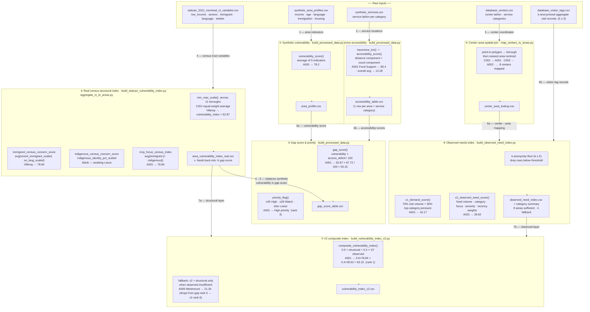
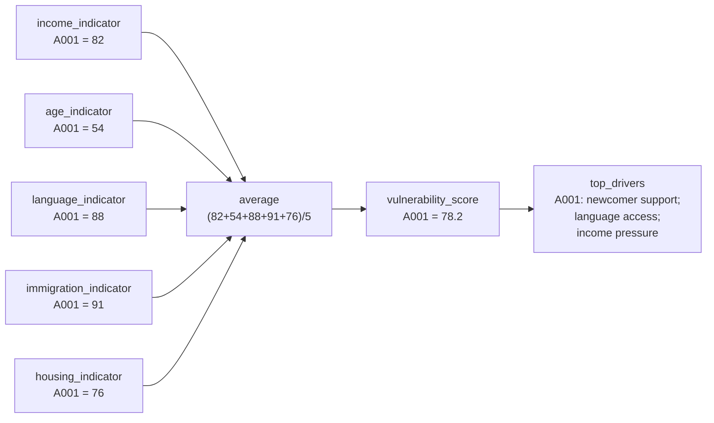
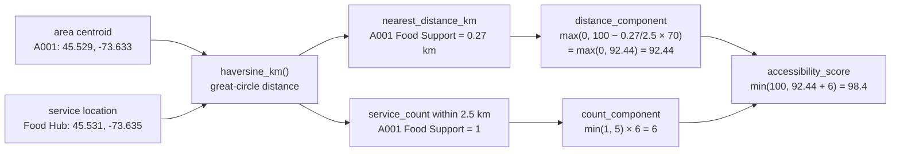
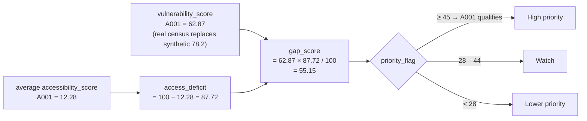
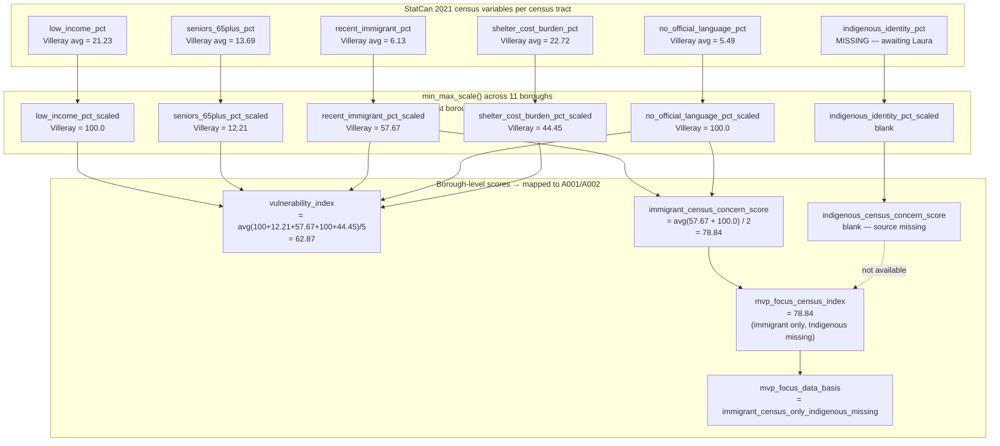
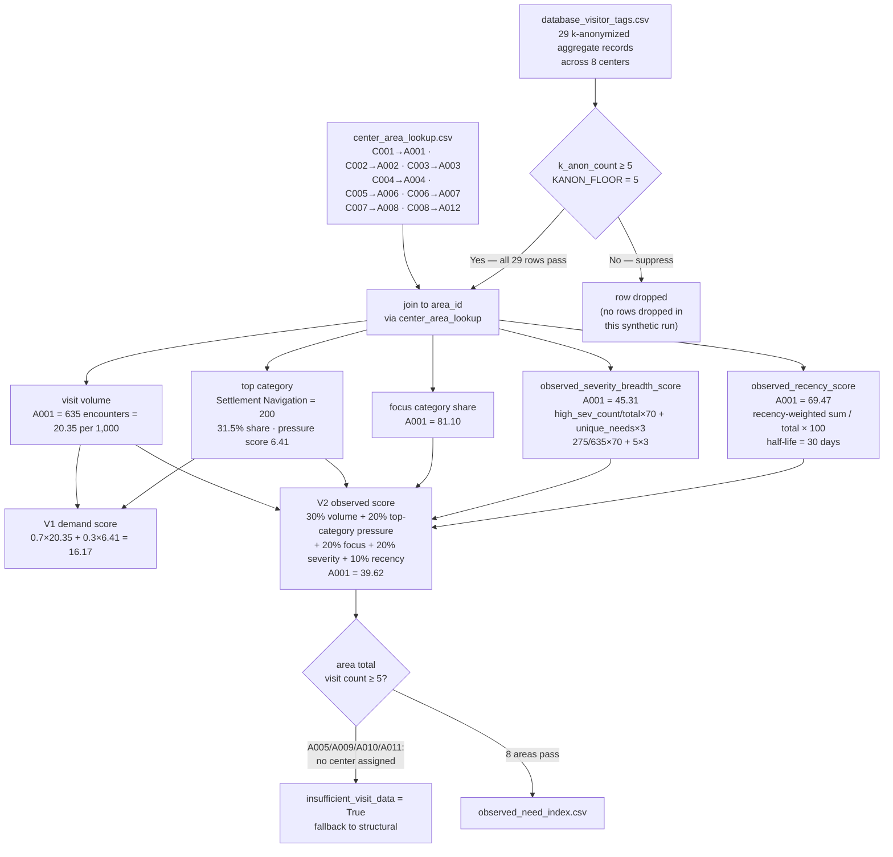
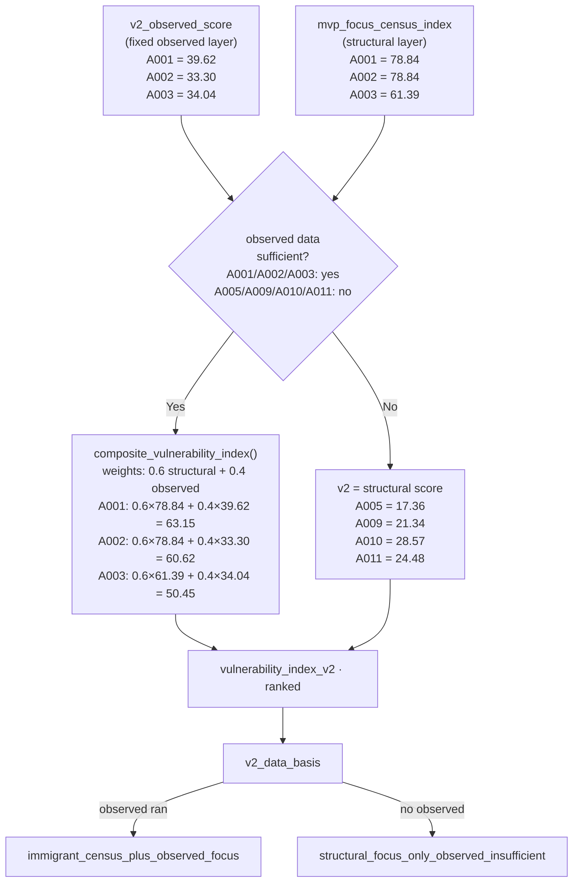
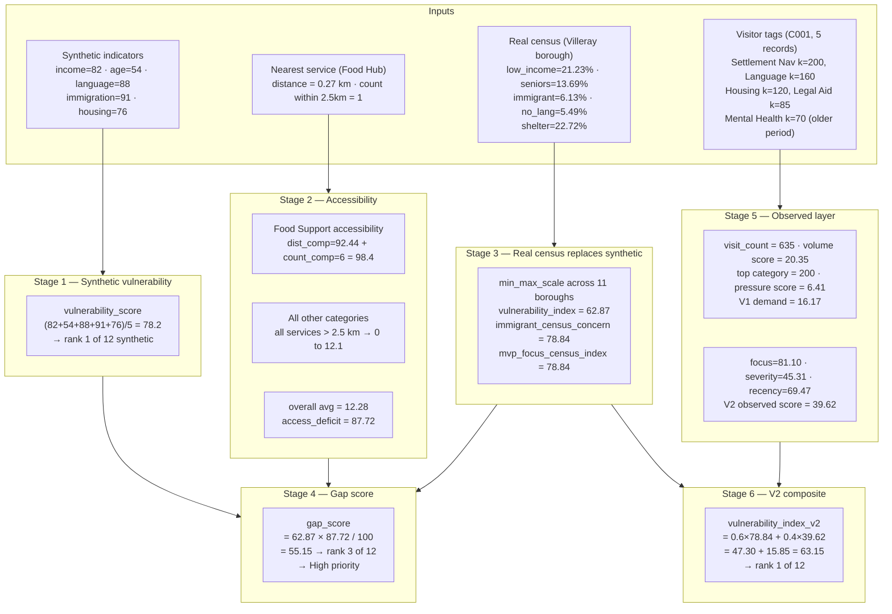

# Scoring And Metrics Guide

Owner: Frondy (geospatial / analytics lead)
Last updated: 2026-07-02
Source of truth: `src/comm_need_radar/scoring/metrics.py`

Example area used throughout: **Parc Extension (A001)** — the top-ranked priority
area. All example values come from the synthetic pipeline run on 2026-07-02.

All scores are in the range **0–100** unless noted.

---

## 1. Overall Pipeline



---

## 2. Synthetic Vulnerability Score

Used in `area_profile.csv`. Replaced by the real census index in
`gap_score_table.csv` when `area_vulnerability_index_real.csv` is present.



**Formula:**

```
vulnerability_score = average(income, age, language, immigration, housing)
top_drivers         = top 3 indicator labels sorted descending
```

**Example — all 12 areas:**

| area_id | Area | income | age | language | immigration | housing | vulnerability_score | top drivers |
|---|---|---:|---:|---:|---:|---:|---:|---|
| A001 | Parc Extension | 82 | 54 | 88 | **91** | 76 | **78.2** | newcomer; language; income |
| A002 | Saint-Michel | 78 | 62 | 72 | **84** | 69 | 73.0 | newcomer; income; language |
| A003 | Cote-des-Neiges | 74 | 58 | 83 | **87** | 71 | 74.6 | newcomer; language; income |
| A004 | Montreal-Nord | **86** | 65 | 69 | 78 | **82** | 76.0 | income; housing; newcomer |
| A005 | Hochelaga | 67 | 50 | 32 | 28 | 73 | 50.0 | income; housing; age |
| A006 | Verdun | 48 | 45 | 26 | 31 | 52 | 40.4 | housing; income; age |
| A007 | Ahuntsic | 42 | **72** | 38 | 44 | 40 | 47.2 | age; newcomer; language |
| A008 | Lachine | 53 | 57 | 29 | 35 | 55 | 45.8 | housing; age; income |
| A009 | Westmount | 15 | 46 | 18 | 24 | 20 | 24.6 | age; newcomer; housing |
| A010 | Plateau | 35 | 34 | 22 | 29 | 45 | 33.0 | housing; income; newcomer |
| A011 | Pointe-Saint-Charles | 61 | 48 | 25 | 30 | 68 | 46.4 | housing; income; newcomer |
| A012 | Riviere-des-Prairies | 58 | 63 | 45 | 50 | 47 | 52.6 | age; income; newcomer |

---

## 3. Haversine Distance And Accessibility Score



**Formula:**

```
distance_component  = max(0,  100 − (nearest_km / 2.5) × 70)
count_component     = min(service_count_within_2.5km, 5) × 6
accessibility_score = min(100, distance_component + count_component)
```

**Example — A001 Parc Extension, all service categories:**

| Service category | Nearest (km) | Count ≤2.5 km | distance_comp | count_comp | accessibility_score |
|---|---:|---:|---:|---:|---:|
| Food Support | 0.27 | 1 | 92.44 | 6 | **98.4** |
| Newcomer Support | 3.14 | 0 | 12.14 | 0 | 12.1 |
| Housing | 3.85 | 0 | 0.00 | 0 | 0.0 |
| Mental Health | 4.59 | 0 | 0.00 | 0 | 0.0 |
| Family Services | 4.18 | 0 | 0.00 | 0 | 0.0 |
| Legal Aid | 5.87 | 0 | 0.00 | 0 | 0.0 |
| Employment | 9.33 | 0 | 0.00 | 0 | 0.0 |
| General Support | 10.93 | 0 | 0.00 | 0 | 0.0 |
| **Overall average** | | | | | **12.28** |

**Scale reference:**

| Nearest (km) | Count ≤2.5 km | Score | Interpretation |
|---:|---:|---:|---|
| 0 | 5+ | 100 | Service at door, abundant |
| 1.25 | 3 | 68 | Moderate walk, some choice |
| 2.5 | 1 | 36 | At threshold, scarce |
| 5.0 | 0 | 0 | Beyond threshold, none nearby |

**Threshold:** `ACCESS_THRESHOLD_KM = 2.5` km. One row per `area_id × service_category`.

---

## 4. Gap Score And Priority Flag



**Formula:**

```
access_deficit = 100 − overall_accessibility_score
gap_score      = vulnerability_score × access_deficit / 100
```

The gap score is highest when an area is both **highly vulnerable** and has
**poor service access**. An area with perfect access (score 100) has gap = 0.

**Example — all 12 areas, gap score ranking:**

| Rank | Area | vulnerability (real) | avg access | access_deficit | gap_score | priority |
|---:|---|---:|---:|---:|---:|---|
| 1 | Cote-des-Neiges | 64.39 | 11.49 | 88.51 | **57.0** | High |
| 2 | Saint-Michel | 62.87 | 10.59 | 89.41 | **56.2** | High |
| 3 | Parc Extension | 62.87 | 12.28 | 87.72 | **55.2** | High |
| 4 | Montreal-Nord | 53.72 | 10.93 | 89.07 | **47.9** | High |
| 5 | Westmount | 52.06 | 11.57 | 88.43 | **46.0** | High |
| 6 | Ahuntsic | 49.75 | 11.61 | 88.39 | **44.0** | Watch |
| 7 | Plateau | 50.94 | 18.02 | 81.98 | **41.8** | Watch |
| 8 | Verdun | 36.89 | 14.23 | 85.77 | **31.6** | Watch |
| 9 | Pointe-Saint-Charles | 35.90 | 19.04 | 80.96 | **29.1** | Watch |
| 10 | Lachine | 32.03 | 10.36 | 89.64 | **28.7** | Watch |
| 11 | Hochelaga | 30.24 | 10.51 | 89.49 | **27.1** | Lower |
| 12 | Riviere-des-Prairies | 11.06 | 10.18 | 89.82 | **9.9** | Lower |

---

## 5. Real Census Vulnerability Index (Structural Layer)

Built by `build_statcan_vulnerability_index.py` and `aggregate_ct_to_areas.py`.
Replaces the synthetic `vulnerability_score` in `gap_score_table.csv`.



**min_max_scale formula:**

```
scaled = (value − borough_min) / (borough_max − borough_min) × 100
```

Scaling happens across the 11 boroughs after borough-level aggregation, so
the single most-pressured borough always scores 100 and the least always 0.

**Example — all 12 areas, real census index:**

| Rank | Area | vulnerability_index | immigrant_score | mvp_focus_census_index | data_basis |
|---:|---|---:|---:|---:|---|
| 1 | Cote-des-Neiges | 64.39 | 61.39 | 61.39 | immigrant_only |
| 2 | Parc Extension | 62.87 | **78.84** | **78.84** | immigrant_only |
| 3 | Saint-Michel | 62.87 | **78.84** | **78.84** | immigrant_only |
| 4 | Montreal-Nord | 53.72 | 43.00 | 43.00 | immigrant_only |
| 5 | Westmount | 52.06 | 21.34 | 21.34 | immigrant_only |
| 6 | Plateau | 50.94 | 28.57 | 28.57 | immigrant_only |
| 7 | Ahuntsic | 49.75 | 55.77 | 55.77 | immigrant_only |
| 8 | Verdun | 36.89 | 26.54 | 26.54 | immigrant_only |
| 9 | Pointe-Saint-Charles | 35.90 | 24.48 | 24.48 | immigrant_only |
| 10 | Lachine | 32.03 | 17.99 | 17.99 | immigrant_only |
| 11 | Hochelaga | 30.24 | 17.36 | 17.36 | immigrant_only |
| 12 | Riviere-des-Prairies | 11.06 | 4.33 | 4.33 | immigrant_only |

Note: Parc Extension and Saint-Michel share the same row because they sit
inside the same borough (Villeray–Saint-Michel–Parc-Extension). Sub-borough
boundaries are needed to differentiate them.

---

## 6. Observed Needs Layer

Built by `map_centers_to_areas.py` + `build_observed_need_index.py`.
Requires `database_centers.csv` and `database_visitor_tags.csv`.



**V1 and V2 separation:**

| Metric | Audience | Inputs | Purpose |
|---|---|---|---|
| `v1_demand_score` | Frontline workers | 70% visit volume + 30% top-category pressure | Summarize current operational demand |
| `v2_observed_score` | Planners/research | Volume, top-category pressure, focus share, severity/breadth, recency | Add current observed evidence to structural vulnerability |
| `vulnerability_index_v2` | Planners/research | 60% structural + 40% V2 observed | Experimental area-level planning rank |

`top_need_share_pct` is displayed but does not enter either score. Counts mean
service encounters, not deduplicated people.

**Tags that drive V2 components:**

| Sub-score | Counted when |
|---|---|
| `immigrant_need` | `key_need` in {Settlement Navigation, Language Access, Immigration Legal Need, Newcomer Support} OR `language_need_flag=1` OR `settlement_need_flag=1` |
| `indigenous_need` | `key_need` in {Indigenous Cultural Support, Indigenous-Led Referral, Indigenous-Specific Service Need} OR `indigenous_specific_need_flag=1` OR `population_group=indigenous` |
| `severity_breadth` | `key_need` in {Housing & Shelter, Mental Health, Health & Wellness, Legal Aid} (high-severity share × 70) + distinct need category count × 3 |
| `recency` | Exponential decay: weight = 0.5^(days_since_period_end / 30) |

**Recency decay examples (today = 2026-07-02):**

| period_end | days ago | decay weight |
|---|---:|---:|
| 2026-06-20 | 12 | **0.758** |
| 2026-04-20 | 73 | **0.185** |
| 2026-03-28 | 96 | **0.109** |

**Example — all areas, observed demand:**

| Area | encounters | top category | V1 demand | V2 observed | sufficient |
|---|---:|---|---:|---:|---|
| Parc Extension (A001) | 635 | Settlement Navigation | **16.17** | **39.62** | yes |
| Saint-Michel (A002) | 553 | Settlement Navigation | 8.95 | 33.30 | yes |
| Cote-des-Neiges (A003) | 850 | Newcomer Support | 13.07 | 34.04 | yes |
| Montreal-Nord (A004) | 445 | Housing & Shelter | 8.18 | 23.76 | yes |
| Verdun (A006) | 270 | General Support | 3.16 | 19.14 | yes |
| Ahuntsic (A007) | 310 | Senior Support | 6.69 | 20.57 | yes |
| Lachine (A008) | 135 | General Support | 4.27 | 16.52 | yes |
| Riviere-des-Prairies (A012) | 12 | General Support | 0.37 | 8.36 | yes |
| Hochelaga (A005) | 0 | — | — | — | — | — | **no** |
| Westmount (A009) | 0 | — | — | — | — | — | **no** |
| Plateau (A010) | 0 | — | — | — | — | — | **no** |
| Pointe-Saint-Charles (A011) | 0 | — | — | — | — | — | **no** |

---

## 7. Vulnerability Index V2 (Composite)

Built by `build_vulnerability_index_v2.py`.



**Composite formula:**

```
vulnerability_index_v2 = 0.6 × mvp_focus_census_index
                       + 0.4 × v2_observed_score
```

The V1-derived inputs contribute 12% visit volume and 8% top-category pressure
to the final V2 score. Focus-category share and severity/breadth contribute 8%
each, and recency contributes 4%.

**Fallback decision logic:**

```
if observed insufficient (no center or visit_count < 5):
    v2 = mvp_focus_census_index
    basis = structural_focus_only_observed_insufficient

elif indigenous census missing but observed ran successfully:
    v2 = 0.6 × immigrant_census_focus + 0.4 × observed_score
    basis = immigrant_census_plus_observed_focus        ← current state (all 8 areas with observed)

else (both census layers complete):
    v2 = 0.6 × mvp_focus_census_index + 0.4 × observed_score
    basis = structural_and_observed_focus
```

**Example — all 12 areas, v2 vs gap ranking:**

| v2 rank | Area | structural | observed | v2_score | gap rank | Δ rank | data_basis |
|---:|---|---:|---:|---:|---:|---:|---|
| 1 | Parc Extension | 78.84 | 39.62 | **63.15** | 3 | +2 | census+observed |
| 2 | Saint-Michel | 78.84 | 33.30 | **60.62** | 2 | 0 | census+observed |
| 3 | Cote-des-Neiges | 61.39 | 34.04 | **50.45** | 1 | −2 | census+observed |
| 4 | Ahuntsic | 55.77 | 20.57 | **41.69** | 6 | +2 | census+observed |
| 5 | Montreal-Nord | 43.00 | 23.76 | **35.30** | 4 | −1 | census+observed |
| 6 | Plateau | 28.57 | — | **28.57** | 7 | +1 | structural only |
| 7 | Pointe-Saint-Charles | 24.48 | — | **24.48** | 9 | +2 | structural only |
| 8 | Verdun | 26.54 | 19.14 | **23.58** | 8 | 0 | census+observed |
| 9 | Westmount | 21.34 | — | **21.34** | 5 | **−4** | structural only |
| 10 | Lachine | 17.99 | 16.52 | **17.40** | 10 | 0 | census+observed |
| 11 | Hochelaga | 17.36 | — | **17.36** | 11 | 0 | structural only |
| 12 | Riviere-des-Prairies | 4.33 | 8.36 | **5.94** | 12 | 0 | census+observed |

Key shifts: **Westmount drops 4 places**, but its structural-only fallback means
the system lacks observed coverage there; it is not evidence of low demand.
**Parc Extension rises 2 places** because its observed focus-category share and
encounter volume are stronger than Saint-Michel's.

---

## 8. Worked Example — Parc Extension (A001), Full Pipeline



**Step-by-step values:**

| Step | Input | Computation | Result |
|---|---|---|---|
| Synthetic score | indicators: 82, 54, 88, 91, 76 | avg(82+54+88+91+76)/5 | **78.2** |
| Food Support access | nearest=0.27 km, count=1 | (100−0.27/2.5×70) + 1×6 | **98.4** |
| Overall access | 8 category scores | average across categories | **12.28** |
| Census scaling | Villeray recent_immigrant=6.13% | min_max across 11 boroughs | 57.67 scaled |
| Census scaling | Villeray no_official_lang=5.49% | min_max across 11 boroughs | 100.0 scaled |
| Real census index | 5 scaled variables | equal-weight average | **62.87** |
| Immigrant concern | recent_immigrant + no_lang scaled | avg(57.67, 100.0) | **78.84** |
| Gap score | vuln=62.87, access=12.28 | 62.87 × (100−12.28) / 100 | **55.15** |
| Visit volume | 635 encounters / 31,200 population | encounters per 1,000 | **20.35** |
| Top category pressure | 200 Settlement Navigation encounters / population | encounters per 1,000 | **6.41** |
| V1 demand | volume=20.35, top pressure=6.41 | 0.7×20.35 + 0.3×6.41 | **16.17** |
| Immigrant need | 515 immigrant-tagged visits / 635 total | 515/635×100 | **81.10** |
| Severity breadth | 275 high-sev / 635 total, 5 unique needs | 275/635×70 + 5×3 | **45.31** |
| Recency score | recent visits × 0.758, older × 0.185 | decay-weighted total / total × 100 | **69.47** |
| V2 observed | volume, top pressure, focus, severity, recency | fixed 30/20/20/20/10 weights | **39.62** |
| V2 composite | structural=78.84, observed=39.62 | 0.6×78.84 + 0.4×39.62 | **63.15** |

---

## 9. Score Ranges Reference

| Score | Range | "100" means | "0" means |
|---|---|---|---|
| `vulnerability_score` (synthetic) | 0–100 | All five indicators at maximum | All five at minimum |
| `vulnerability_index` (real census) | 0–100 | Worst borough across 11 boroughs | Best borough |
| `immigrant_census_concern_score` | 0–100 | Highest immigrant + language-barrier share | Lowest shares |
| `indigenous_census_concern_score` | 0–100 | Highest Indigenous identity share | Lowest |
| `mvp_focus_census_index` | 0–100 | Worst focus-group structural concern | Lowest concern |
| `accessibility_score` | 0–100 | Service at door, 5+ within 2.5 km | No service within 7.2 km |
| `gap_score` | 0–100 | Max vulnerability + zero access | Either dimension is zero |
| `observed_immigrant_need_score` | 0–100 | All visits are immigrant/language/settlement-focused | None |
| `observed_indigenous_need_score` | 0–100 | All visits are Indigenous-specific | None |
| `observed_severity_breadth_score` | 0–100 | All visits are high-severity, 10+ distinct need categories | Zero |
| `observed_recency_score` | 0–100 | All visits happened today | All visits > 5 months old |
| `v1_demand_score` | 0–100 | Maximum visit volume and top-category pressure | No observed demand |
| `v2_observed_score` | 0–100 | Maximum across all five fixed observed components | All components at zero |
| `observed_focus_need_score` | 0–100 | Compatibility alias for `v2_observed_score` | All components at zero |
| `vulnerability_index_v2` | 0–100 | Worst structural + observed concern | Lowest across both |

---

## 10. Script Run Order

```bash
# Rebuild synthetic pipeline
python3 scripts/generate_synthetic_data.py
python3 scripts/build_processed_data.py          # wires real census if present

# Real census structural layer
python3 scripts/build_statcan_vulnerability_index.py
python3 scripts/aggregate_ct_to_areas.py         # requires shapely; use .venv

# V2 observed + composite layer
python3 scripts/map_centers_to_areas.py
python3 scripts/build_observed_need_index.py [--window-days 90]
python3 scripts/build_vulnerability_index_v2.py

# Tests
python3 -m unittest discover -s tests
```

---

## 11. Constants Quick Reference

| Constant | Value | Where used |
|---|---|---|
| `ACCESS_THRESHOLD_KM` | 2.5 km | `accessibility_score`, `build_accessibility` |
| `K_ANON_FLOOR` | 5 | `has_sufficient_observed_data`, `build_observed_need_index` |
| `STRUCTURAL_WEIGHT` | 0.6 | `composite_vulnerability_index` |
| `OBSERVED_WEIGHT` | 0.4 | `composite_vulnerability_index` |
| `V1_VOLUME_WEIGHT` | 0.7 | `v1_demand_score` |
| `V1_TOP_CATEGORY_WEIGHT` | 0.3 | `v1_demand_score` |
| `V2_OBSERVED_WEIGHTS` | 0.3 / 0.2 / 0.2 / 0.2 / 0.1 | `v2_observed_need_score` |
