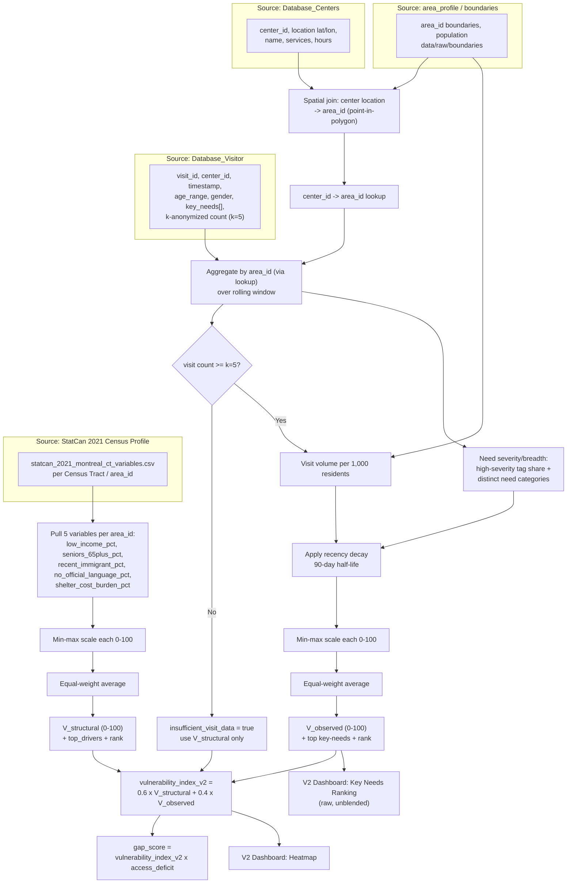

# Vulnerability Index v2 — Design Plan

Covers the score that the updated System Flow (V2 Dashboard heatmap) and Data Flow
(`Database_Visitor` + `Database_Centers`) need. Builds on the existing CISV-style
index in [`census-variable-dictionary.md`](census-variable-dictionary.md) and
`scripts/build_statcan_vulnerability_index.py` — it does not replace that work, it
adds a second layer on top of it.

## Decision

Two-layer composite score, recomputed per area:

```
vulnerability_index_v2 = w1 * V_structural + w2 * V_observed
```

- **`V_structural`** (0–100): the existing census-based index (5 StatCan variables,
  min-max scaled, equal weight). Slow-changing, full coverage, already built.
- **`V_observed`** (0–100): new — derived from real frontline-visit tags
  (`Database_Visitor`) joined through `Database_Centers` to the same area grain.
  Fast-changing, partial coverage (only areas with active centers/visits).
- Default weights `w1 = 0.6`, `w2 = 0.4`, stored as named constants (not magic
  numbers) so the team can tune them later without re-deriving the formula.
  Structural carries more weight initially because census coverage is complete
  and visit volume will be small/noisy in the MVP.

Rejected alternatives: replacing the census index outright (loses coverage for
areas/people who haven't visited a center yet, and is unstable at low visit
counts); keeping the two scores fully separate (loses the single "how urgent is
this area" number the Planner view and Centraide funding reports want — though
the Key Needs Ranking panel should still show `V_observed`'s raw need-mix
unblended, see below).

## MVP focus update: immigrants and Indigenous communities

Recent meeting notes narrowed the MVP focus to two groups: immigrants and
Indigenous communities. The census layer has been rebuilt with explicit focus
columns:

- `immigrant_census_concern_score`: average of `recent_immigrant_pct_scaled` and
  `no_official_language_pct_scaled`.
- `indigenous_census_concern_score`: uses `indigenous_identity_pct_scaled` when
  the raw census source includes `indigenous_identity_pct`.
- `mvp_focus_census_index`: average of available focus concern scores.
- `mvp_focus_data_basis`: records whether the score is immigrant-only or includes
  Indigenous census data.

Current real-data limitation: the raw StatCan extract in this repo does not yet
include `indigenous_identity_pct`, so the rebuilt outputs flag
`immigrant_census_only_indigenous_missing`. Indigenous-specific concern should be
filled either by adding the missing census column or, preferably for service
planning, by k-anonymized observed needs from `Database_Visitor`.

## V_observed — sub-components

Computed per `area_id` from `Database_Visitor` k-anonymized counts (k=5),
mirroring the existing CISV methodology (min-max scale each component to 0–100,
then equal-weight average):

1. **Visit volume** — k-anonymized visit count in the area over a rolling window
   (e.g. trailing 90 days), normalized per 1,000 residents (`area_profile.population`)
   so dense and sparse areas are comparable.
2. **Need severity/breadth** — share of visits tagging high-severity categories
   (Housing & Shelter, Mental Health, Health & Wellness) plus count of distinct
   key-need categories per visit, averaged.
3. **Recency weighting** — apply exponential decay (e.g. 90-day half-life) before
   aggregating, so a spike last week outweighs the same volume six months ago.
   This is what makes the score "real-time" for the Centraide funding/report loop.

**Confidence flag**: if an area's rolling visit count is below the k=5 anonymization
floor, do not compute `V_observed` for it — fall back to `V_structural` alone and
mark the row `insufficient_visit_data = true`. Never report observed-need numbers
under k=5, even internally.

## Grain alignment

`Database_Centers` has lat/lon, not `area_id`. Add a one-time spatial join
(point-in-polygon against the boundaries already in `data/raw/boundaries`) producing
a `center_id -> area_id` lookup. Every visitor record inherits its center's `area_id`
through this lookup before aggregation.

## Update cadence

| Layer | Source | Refresh |
|---|---|---|
| `V_structural` | StatCan census | Per census release (~5 yr), via existing `build_statcan_vulnerability_index.py` |
| `V_observed` | `Database_Visitor` | Rolling batch (e.g. nightly), via new `build_observed_need_index.py` |
| `vulnerability_index_v2` | both | Recomputed whenever either layer refreshes |

## Implementation steps

1. `scripts/map_centers_to_areas.py` — build the `center_id -> area_id` lookup.
2. `data/raw/synthetic_visitor_tags.csv` — MVP synthetic visitor tags (age_range,
   gender, key_needs, timestamp, center_id, k_anon_count) shaped like
   `Database_Visitor`, same pattern as the existing `synthetic_area_profiles.csv`.
3. `scripts/build_observed_need_index.py` — aggregate by `area_id` + rolling window,
   compute the 3 sub-components, scale, combine into `V_observed`, emit
   `data/processed/observed_need_index.csv` (same shape conventions as
   `census_vulnerability_index.csv`: scaled columns, `top_drivers`/top-needs, rank).
4. Extend `src/comm_need_radar/scoring/metrics.py`:
   - `observed_need_score(row)`
   - `composite_vulnerability_index(v_structural, v_observed, w1=0.6, w2=0.4)`
   - confidence-flag helper for the k=5 floor
5. Wire the composite into the existing pipeline: `gap_score` already consumes
   `vulnerability_score` — point it at `vulnerability_index_v2` instead, so
   high-priority-area logic and the Planner view automatically pick it up.
6. V2 Dashboard:
   - Heatmap colors by `vulnerability_index_v2`, with a toggle to view
     `V_structural`-only (for areas with `insufficient_visit_data`).
   - Key Needs Ranking panel reads the raw key-need tag counts from the
     `V_observed` aggregation directly (unblended) — that panel is about which
     needs are most common, not about the composite severity score.
7. Documentation: record the `w1`/`w2` decision in `docs/decisions.md`, and add a
   `docs/visitor-tag-dictionary.md` (same format as
   `census-variable-dictionary.md`) defining the visitor tag fields and the k=5
   floor rule, since that's the privacy-sensitive contract O1 in the System Flow
   diagram refers to.

## Construction diagram — sources to index



| Source | Data needed | Feeds |
|---|---|---|
| StatCan 2021 Census Profile | `low_income_pct`, `seniors_65plus_pct`, `recent_immigrant_pct`, `no_official_language_pct`, `shelter_cost_burden_pct` per `area_id` | `V_structural` |
| `Database_Centers` | `center_id`, location (lat/lon) | center→area spatial join |
| `area_profile` / boundaries | area polygons, `population` | spatial join target; visit-volume normalization |
| `Database_Visitor` | `center_id`, `timestamp`, `age_range`, `gender`, `key_needs[]`, k-anonymized count (k=5) | `V_observed` |

## Out of scope for this plan

- The V1 Flyer Generator's per-individual service matching uses the raw key-need
  tags directly, not the area-level index — no change needed there.
- Person-level vulnerability scoring. The k=5 anonymization in `Database_Visitor`
  means this index is necessarily area/center-level, never individual-level.
